## 1.1 INSTALL LINUX ON VM ##

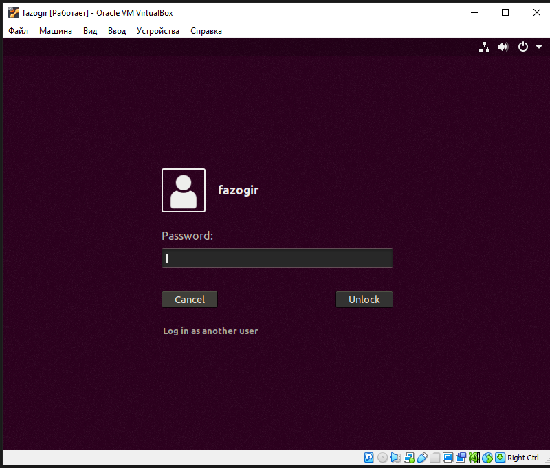
 

## 1.2  Take screenshot OS release  ##

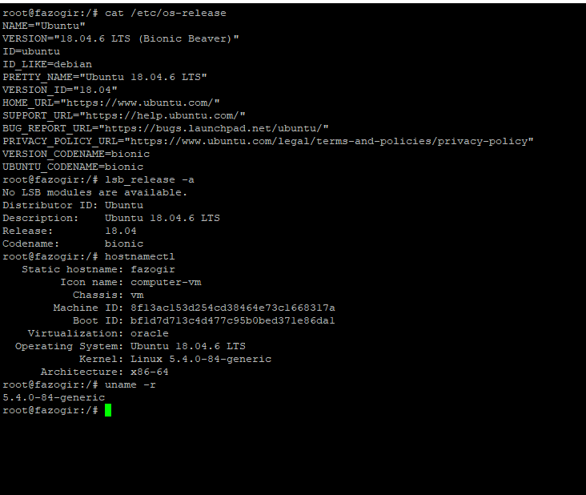

## 1.3 Check internet connection with ping ##

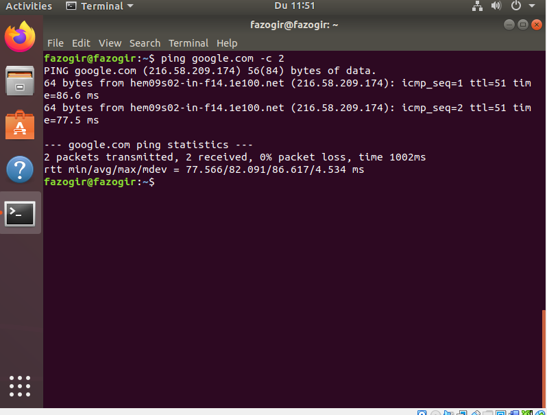

## 1.4 Answer what is shell in linux ##

## 1.5 Find what are these symbols $, # (dollar ($) and pound (#)). ##

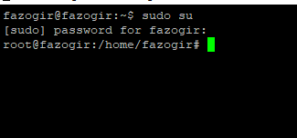

## 1.6. Learn commands: whoami, grep ${USER} /etc/passwd ## 

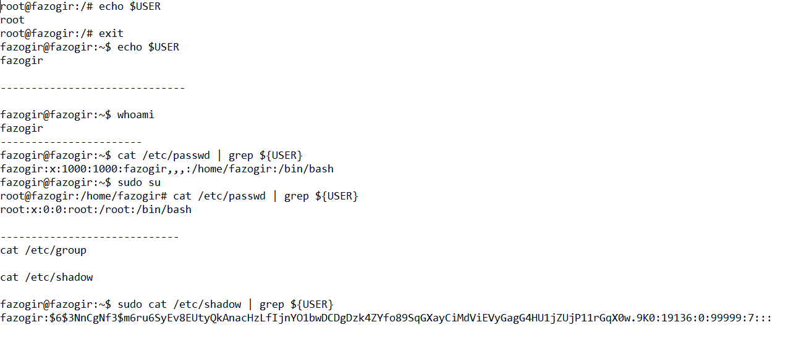

## 1.7 Learn deeply this command man ##

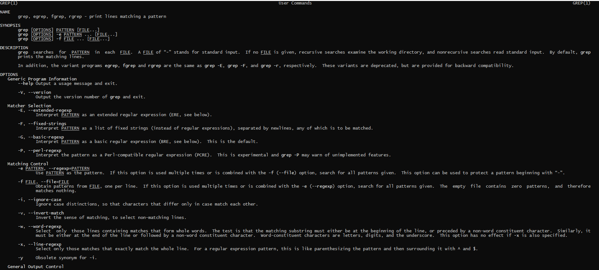

## 1.8 Learn commands: date, pwd, ls, uname, id, who ##
## - Print date like following format   ##
## a) 23:05:22 ##
## b) 22-05-2022 ##

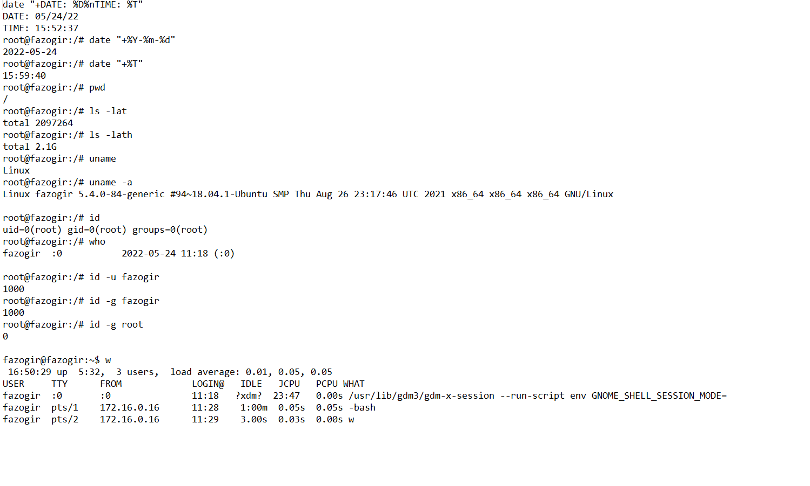

## Print system info like this ##
Linux ideapad 5.13.0-41-generic #46~20.04.1-Ubuntu SMP Wed Apr 20 13:16:21 UTC 2022 x86_64 x86_64 x86_64 GNU/Linux
## Find out information about your identity ##
## Show information about your current login session ##

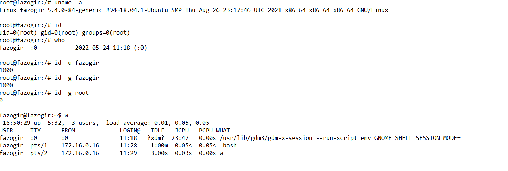

## 1.9 Learn about command line completion ##
## Command, alias or function ##
##  - Variable ##
##  - Username ##
##  - Hostname ##

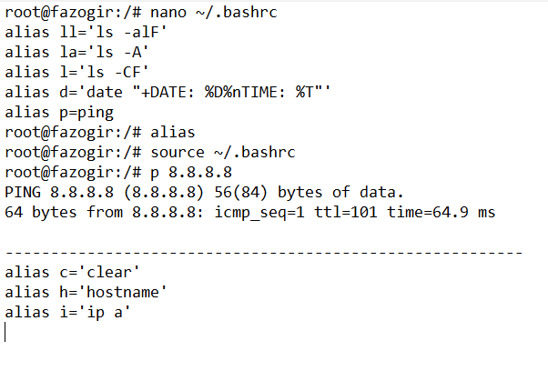

## - Command-line recall ##

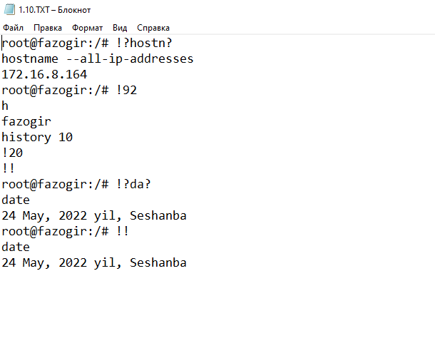

## Piping commands ## 

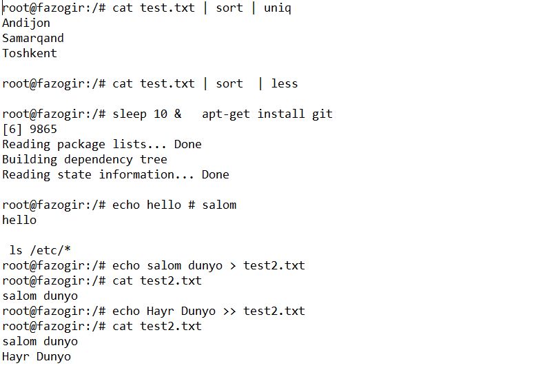

