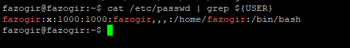

## 1.1 INSTALL LINUX ON VM ##

 

## 1.2  Take screenshot OS release  ##

## 1.3 Check internet connection with ping ##

## 1.4 Answer what is shell in linux ##

## 1.5 Find what are these symbols $, # (dollar ($) and pound (#)). ##

## 1.6. Learn commands: whoami, grep ${USER} /etc/passwd ## 

## 1.7 Learn deeply this command man ##

## 1.8 Learn commands: date, pwd, ls, uname, id, who ##
## - Print date like following format   ##
## a) 23:05:22 ##
## b) 22-05-2022 ##

## Print system info like this ##
Linux ideapad 5.13.0-41-generic #46~20.04.1-Ubuntu SMP Wed Apr 20 13:16:21 UTC 2022 x86_64 x86_64 x86_64 GNU/Linux
## Find out information about your identity ##
## Show information about your current login session ##

## 1.9 Learn about command line completion ##
## Command, alias or function ##
##  - Variable ##
##  - Username ##
##  - Hostname ##

## - Command-line recall ##

## Piping commands ## 
## 1.11 |, &, <, >, ; ##
##  - cat /etc/passwd | sort | less (understand this commands) ##
##  - date; ping google.com -c 2; echo "This is sequential commands" ##

##  1.12 Learn shell(environment) variable ##

##  echo $USER ##
##  Research and lern common Shell Environment Variables ##
##  Learn and create alias ##
## p=ping -c 4 ## 

## Homework ##

## Type the following three commands, and then recall and change those commands as described: ##
## $ cat /etc/passwd ##
## $ ls $HOME ##
## $ date ## 
 ##  a. Use the command-line recall feature to recall the cat command and change /etc/passwd to /etc/group. ## 
 ## b. Recall the ls command, determine how to list files by time (using the man page), and add that option to the ls $HOME command line. ## 
 ## c. Add format indicators to the date command to display the date output as month/day/year ##
 ## a. ##
 
 ## b. ##
 
## c. ##
 

 ##  2.  Run the date command in such a way that the output from that command produces the current day, month, date, and year. Have that read into another command line, resulting in text that appears like the following (your date, of course, will be different): Today is Thursday, December 19, 2019. ##

 

 ## 3. Using variables, find out what your hostname, username, shell, and home directories are currently set to. ##

 
## 4. Create an alias called mypass that displays the contents of the /etc/passwd file on your screen in such a way that it is available every time you log in or open a new shell from your user account. ##

