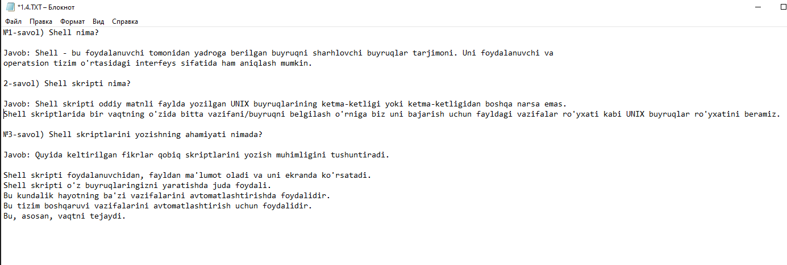

## 1.1 INSTALL LINUX ON VM ##

 

## 1.2  Take screenshot OS release  ##

## 1.3 Check internet connection with ping ##

## 1.4 Answer what is shell in linux ##

## 1.5 Find what are these symbols $, # (dollar ($) and pound (#)). ##

